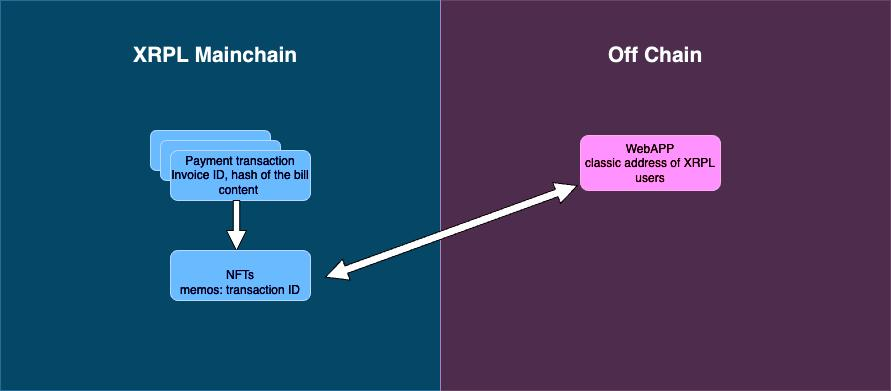
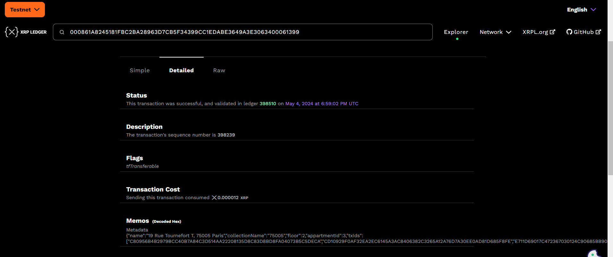
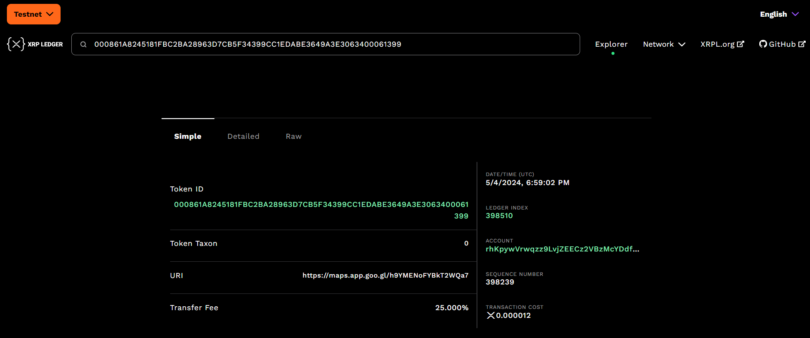
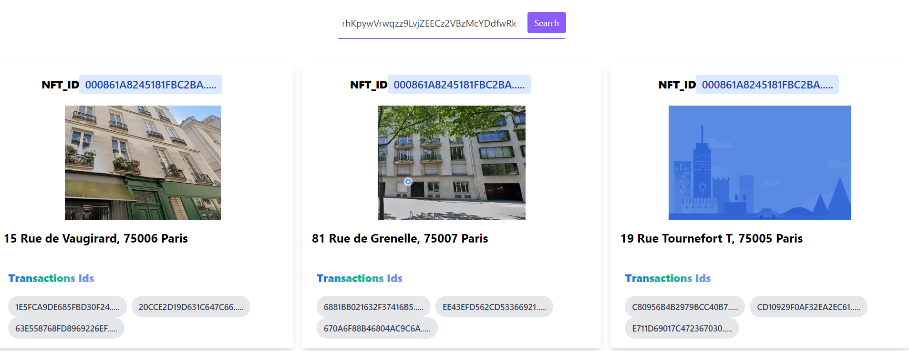

# XRPL Hackathon

### Docs

https://github.com/XRPLF/xrpl-dev-portal/blob/master/_code-samples/quickstart/js/ripplex3-mint-nfts.js

https://xrpl.org/docs/references/http-websocket-apis/public-api-methods/account-methods/account_nfts/

https://xrpl.org/docs/references/protocol/transactions/types/nftokenmint/

### Project Architecture



### NFTS

1. Get the content bill doc hash 

```console
npm run hash_doc
```

2. Create payments txns

- put the hash doc in the InvoiceID
- run the command 

```console
npm run payment
```

3. Mint the NFT

We use the memos as a storage for the metadata

- include in the memo field the list of txns
- run the command 
```console
npm run mint_nfts
```
- in the txn result get the nftoken_id in meta

```
Transaction result: {
  Account: 'rLeYKKxAcYrvBPvw69AMdHyGEAiZrCGrZu',
  Fee: '12',
  Flags: 8,
  LastLedgerSequence: 392268,
  Memos: [ { Memo: [Object] } ],
  NFTokenTaxon: 0,
  Sequence: 248683,
  SigningPubKey: 'ED32708DDFB2399C9053341664174AB83FE58973EE313DDEB58144ECB94571FEC5',
  TransactionType: 'NFTokenMint',
  TransferFee: 25000,
  TxnSignature: '1A5C1702C23AB947723DD3053BD792A59AC508BC9440884C02439CA3FCFDB4AA00F6E812EA8360CA87271BF036B6048DA4074E9A30D2211ECA5DD15FE414B405',
  URI: '68747470733A2F2F6D6170732E6170702E676F6F2E676C2F735054487950446836734854396A434438',
  ctid: 'C005FC3A00000001',
  date: 768145350,
  hash: '71532261E21983531F60A9F4AB7B00E74BD13818720443CF0688DC92C70804C3',
  inLedger: 392250,
  ledger_index: 392250,
  meta: {
    AffectedNodes: [ [Object], [Object] ],
    TransactionIndex: 0,
    TransactionResult: 'tesSUCCESS',
    nftoken_id: '000861A8D783EBF762A2BC5020388F906975809BCFBCFB4041CD30060003CB6B'
  },
  validated: true
}
```

https://testnet.xrpl.org/transactions/EB66195DCA41E3F998B2903EB4E68CB3D2269C70A105374B6DF439053332B0E8/detailed





4. Get the NFT memo data with the NFT token id

```console
npm run get_memo
```

### REACT APP

```console
cd my-app
npm start
```

You enter your classic address to collect your nfts

